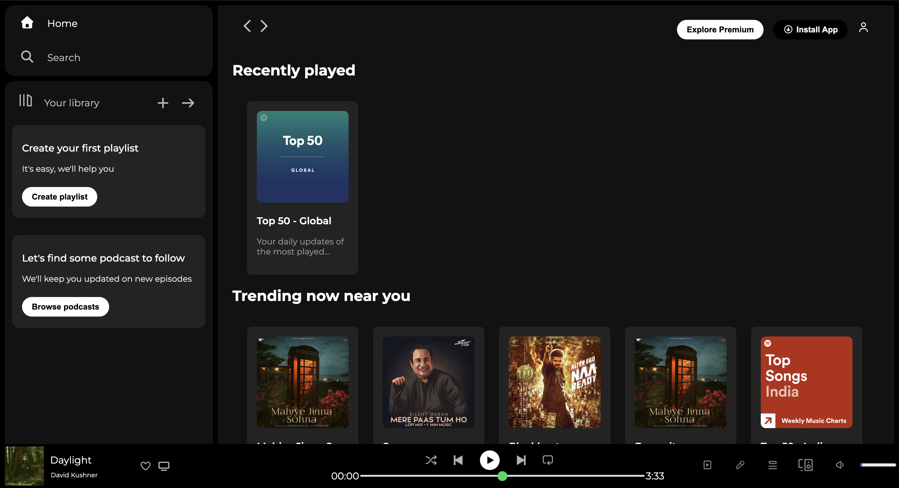
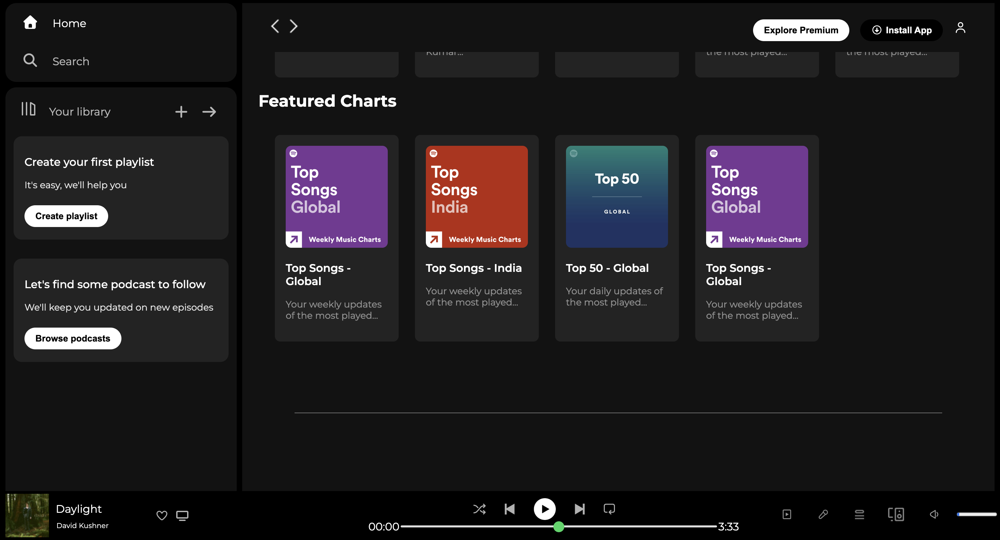

# Spotify Clone  

## Description  
A simple Spotify Clone UI made only with **HTML and CSS**.  
It includes a sidebar, music library, cards, and a bottom music player.  

## Live Demo  
https://macnac-c.github.io/SPOTIFY-CLONE---PROJECT/ 

## Features  
- Sidebar with navigation  
- Music library section  
- Responsive cards for albums/playlists  
- Sticky music player with controls  

## Technologies Used  
- HTML  
- CSS  

## Assets  
Placed all images inside an **assets/** folder.  

## Note  
🔹 This project is currently **optimized for desktop view**.  
🔹 Mobile view may not display correctly.  

---

## Screenshots  

### Home Page  

### Music Player  

